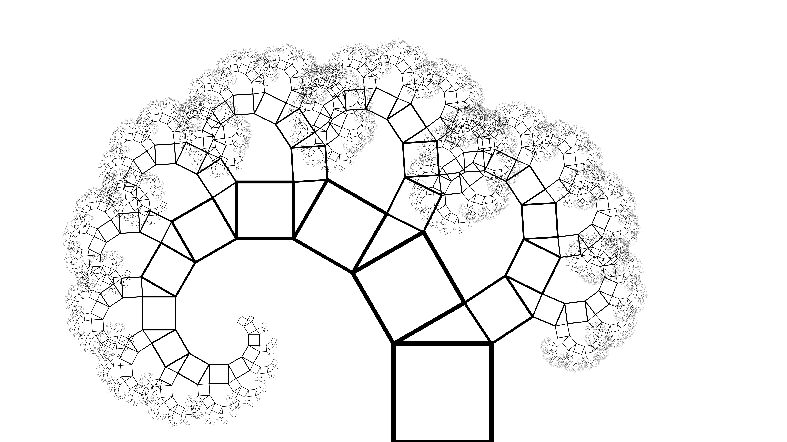

# G1 - Rekursive Figuren


Dieses Programm erstellt rekursive Figuren und speichert sie in einer SVG datei ab.

Ihr könnt ruhig selbst mit dem Programm rumspielen.  
Dafür müsst ihr nur das Programm runterladen und die konstanten Variablen in dem ```## SETTINGS ##``` Abschnitt nach belieben verändern.

## Vokabeln & Vorwissen

Dieses Programm macht viel mit dem SVG Standart. Mehr zu wie es das macht und eine kleine Übersicht [hier](docs/svg.md).

Eine kleine Liste an wichtigen Vokabeln: (Ja, ich weiß; das ist alles ein schreckliches Deutsch-Englisch Gemisch)
 - **Node**: so werden oft die verschiedenen Knotenpunkte einer rekursiven Struktur genannt. In userem Programm zeichnet aber jede Node außerdem eine "Figur"
 - **Figur**: die einfache Form, die rekursiv gezeichnet wird. [Hier](assets/title_image.png) ist die Figur eine Line. Sie kann aber auch ein Dreieck oder Quadrad (oder jegliche andere Form) sein
 - **Parent**: eine Parent Node ist einfach die Node, die die Child Node hervorgerufen hat. Könnt ihr euch so ähnlich wie beim Stammbaum vorstellen.
 - **Child**: siehe ```Parent```
 - **Mother node**: Die allererste Node. Sie wird in der Regel im Programm direkt aufgerufen.

## Einstellungen
 
*Note*: Einige Erklärungen machen möglicheweise keinen Sinn, wenn ihr das Programm noch nicht versteht

| Einstellung               | mögliche Werte   | Erklärung                                               |
| :------------------------ | :--------------- | :------------------------------------------------------ |
| **General**                                                                                            |
| ```mode```                | "line", "quad"   | Die Formen die erstellt werden sollen                   |
| ```submode```             | None, "pythagoras" | Ein weiterführender Modus, der für manche spezielle Figuren nötig ist |
| ```start```               | "top", "bottom", "mid" | Wo die Figur anfangen sollte                      |
|                                                                                                        |
| **Board**                                                                                              |
| ```heigth```              | pos. float       | Die Höhe des SVGs                                       |
| ```width```               | pos. float       | Die Breite des SVGs                                     |
|                                                                                                        |
| **Size**                                                                                               |
| ```initial_size```        | pos. float       | die Größe der ersten Generation                         |
| ```dropoff```             | float            | wie schnell die Größe & Linienbreite sich verändert     |
| ```exponential_dropoff``` | bool             | ob die Größe exponentiell kleiner werden soll           |
| ```line_width```          | pos. float       | die Linienbreite, abhänging von der Länge               |
|                                                                                                        |
| **Rotation**                                                                                           |
| ```keep_rotation```       | bool             | ob die Rotation vererbt werden soll                     |
| ```spread```              | -360 zu 360      | die rotation des childs dem parent gegenüber            |
|                                                                                                        |
| **Colour**                                                                                             |
| ```colour_background```   | hex colour str   | Die Farbe des Hintergrundes. ```None``` für keine       |
| ```colour_lines```        | hex colour str   | Die Farbe der linien. ```None``` für keine              |
|                                                                                                        |
| **Location**                                                                                           |
| ```anchor_child```        | "corner", "edge" | An welcher Stelle des Childs C1-4 liegt                 |
| ```anchor_parent```       | "corner", "edge" | An welcher Stelle des Parents C1-4 liegt                |
|                                                                                                        |
| **Generations & Children**                                                                             |
| ```max_generations```     | pos. int         | Die anzahl an generationen, die generiert werden sollen |
| ```children_count```      | pos int          | Wie viele children jedes mal generiert werden sollen    |

**Tipp**: Spielt einfach mit den Einstellungen rum, um rauszufinden was sie tun.

### Voreinstellungen

---

<details>
  <summary> Einstellungen für das Titelbild</summary>

  

  | Einstellung               | Wert           |
  | :-----------------        | :------------- |
  | **General**                                |
  | ```mode```                | "line"         |
  | ```submode```             | None           |
  | ```start```               | "top"          |
  | **Board**                                  |
  | ```heigth```              | 900            |
  | ```width```               | 1600           |
  | **Size**                                   |
  | ```initial_size```        | 200            |
  | ```dropoff```             | 1.38           |
  | ```exponential_dropoff``` | True           |
  | ```line_width```          | 1/20           |
  | **Rotation**                               |
  | ```keep_rotation```       | True           |
  | ```spread```              | None           |
  | **Colour**                                 |
  | ```colour_background```   | None           |
  | ```colour_lines```        | "#FFFFFF"    |
  | **Location**                               |
  | ```anchor_child```        | "corner"       |
  | ```anchor_parent```       | "corner"       |
  | **Generations & Children**                 |
  | ```max_generations```     | 10             |
  | ```children_count```      | 2              |

</details>

<details>
  <summary> Einstellungen für den Quadratbaum</summary>

  

  | Einstellung               | Wert           |
  | :-----------------        | :------------- |
  | **General**                                |
  | ```mode```                | "quad"         |
  | ```submode```             | None           |
  | ```start```               | "bottom"       |
  | **Board**                                  |
  | ```heigth```              | 900            |
  | ```width```               | 1600           |
  | **Size**                                   |
  | ```initial_size```        | 200            |
  | ```dropoff```             | 2              |
  | ```exponential_dropoff``` | True           |
  | ```line_width```          | 1/20           |
  | **Rotation**                               |
  | ```keep_rotation```       | True           |
  | ```spread```              | 45             |
  | **Colour**                                 |
  | ```colour_background```   | "#FFFFFF"    |
  | ```colour_lines```        | "#000000"    |
  | **Location**                               |
  | ```anchor_child```        | "edge"         |
  | ```anchor_parent```       | "corner"       |
  | **Generations & Children**                 |
  | ```max_generations```     | 5              |
  | ```children_count```      | 2              |

</details>

<details>
  <summary> Einstellungen für die Quadratpflanze</summary>

  

  | Einstellung               | Wert           |
  | :-----------------        | :------------- |
  | **General**                                |
  | ```mode```                | "quad"         |
  | ```submode```             | None           |
  | ```start```               | "bottom"       |
  | **Board**                                  |
  | ```heigth```              | 900            |
  | ```width```               | 1600           |
  | **Size**                                   |
  | ```initial_size```        | 300            |
  | ```dropoff```             | 3              |
  | ```exponential_dropoff``` | True           |
  | ```line_width```          | 1/20           |
  | **Rotation**                               |
  | ```keep_rotation```       | True           |
  | ```spread```              | 90             |
  | **Colour**                                 |
  | ```colour_background```   | "#FFFFFF"    |
  | ```colour_lines```        | "#000000"    |
  | **Location**                               |
  | ```anchor_child```        | "edge"         |
  | ```anchor_parent```       | "edge"         |
  | **Generations & Children**                 |
  | ```max_generations```     | 4              |
  | ```children_count```      | 3              |

</details>

<details>
  <summary> Einstellungen für die Quadratspirale</summary>

  

  | Einstellung               | Wert           |
  | :-----------------        | :------------- |
  | **General**                                |
  | ```mode```                | "quad"         |
  | ```submode```             | None           |
  | ```start```               | "bottom"       |
  | **Board**                                  |
  | ```heigth```              | 900            |
  | ```width```               | 1600           |
  | **Size**                                   |
  | ```initial_size```        | 200            |
  | ```dropoff```             | 1.38           |
  | ```exponential_dropoff``` | True           |
  | ```line_width```          | 1/20           |
  | **Rotation**                               |
  | ```keep_rotation```       | True           |
  | ```spread```              | 45             |
  | **Colour**                                 |
  | ```colour_background```   | "#FFFFFF"    |
  | ```colour_lines```        | "#000000"    |
  | **Location**                               |
  | ```anchor_child```        | "corner"       |
  | ```anchor_parent```       | "corner"       |
  | **Generations & Children**                 |
  | ```max_generations```     | 10             |
  | ```children_count```      | 1              |

</details>

<details>
  <summary> Einstellungen für den Pythagoras-Baum</summary>

  

  | Einstellung               | Wert           |
  | :-----------------        | :------------- |
  | **General**                                |
  | ```mode```                | "quad"         |
  | ```submode```             | "pythagoras"   |
  | ```start```               | "bottom"       |
  | **Board**                                  |
  | ```heigth```              | 900            |
  | ```width```               | 1600           |
  | **Size**                                   |
  | ```initial_size```        | 200            |
  | ```dropoff```             | 1.2            |
  | ```exponential_dropoff``` | True           |
  | ```line_width```          | 1/20           |
  | **Rotation**                               |
  | ```keep_rotation```       | True           |
  | ```spread```              | 30             |
  | **Colour**                                 |
  | ```colour_background```   | "#FFFFFF"    |
  | ```colour_lines```        | "#000000"    |
  | **Location**                               |
  | ```anchor_child```        | "corner"       |
  | ```anchor_parent```       | "corner"       |
  | **Generations & Children**                 |
  | ```max_generations```     | 14             |
  | ```children_count```      | 1              |

</details>

---

## Kurzer Überblick des Programmes

Importieren des "math" modules für sinus, cosinus, pi, etc:

```python
import math
```

### SVG Zeug

---

Deklaration von ganz schön viel Zeugs, um mit SVGs zu interagieren.  
Keine Sorge: das sieht schlimmer aus, als es ist!

Die Datei öffnen, leeren (damit wir keine alten Daten mehr haben) und den xml + svg header reinschreiben:

```python
## SVG STUFF ##
# Diese Funktion schreibt den SVG header und den Hintergrund in die SVG Datei
def init_file(filename):
  open(filename, 'w').close() # SVG Datei leeren
  to_file('<?xml version="1.0" encoding="UTF-8"?>') # xml header
  to_file(f'<svg xmlns="http://www.w3.org/2000/svg" width="{str(svg_width)}" height="{str(svg_height)}">') # svg header

  # Hintergrund
  draw_rect(width=svg_width, height=svg_height, colour=colour_background)
  # Kleiner contents marker; macht die svg Datei weningstents ein bisschen übersichtlicher
  to_file('<!-- vv Contents vv -->\n')
```

---

Eine super einfache Funktion, um mit nur einem Befehl Daten in die SVG zu schreiben:

```python
# Diese Funktion schreibt strings in die SVG Datei
def to_file(contents: str):
  try: # Error handling
    with open(file, 'a') as f: # SVG Datei öffnen
      f.write(contents + "\n") # Contents in die SVG Datei schreiben
  except: # (try-except-struktur: wenn die Befehle oben einen Crash produzieren, wird stattdessen der Code hier vv ausgeführt)
    print("Error writing to svg file!")
```

Hier benutzen wir eine Try-Except-Struktur, die wir im Unterricht noch nicht hatten.  
Diese Strukturen können benutzt werden um Crashes vorzubeugen:  
Sollte eigentlich das Programm, aufgrund des Codes unter ```try```, crashen, führt Python einfach stattdessen den Code unter ```except``` aus.

Mit ```with open(pfad_zur_datei, modus) as variablenname``` kann man in Python Dateien als ein Text öffnen.  
Wir benutzen: 

```python
with open(file, 'a') as f:
```

Also:
 - Datei: Inhalt der ```file``` variable (also 'image.svg')
 - Modus: ```a```: append mode; wir werden den Inhalt der Datei nicht ersetzen, sondern anhängen
 - Name: ```f```: steht für 'file' (dieser Name ist ja aber schon vergeben); ist die Variable, welche die Datei representiert, mit der wir arbeiten, wenn wir die Datei bearbeiten wollen.

Und dann können wir neue Linien mit ```f.write(some_string)``` hinzufügen:

```python
f.write(contents + "\n")
```

*Note*: ```\n``` bedeutet 'newline', also eine neue zeile, denn 'write' fügt nicht automatisch einen Zeilenumbruch hinzu.

*Note*: Wir benutzen hier kein ```f.close()```, da ```with``` das für uns macht.

Mehr infos zu Python's ```open``` Befehl [hier](https://docs.python.org/3/library/functions.html#open).

---

Wie der Kommentar sagt, diese Funktion fügt eine Linie zu der SVG Datei hinzu:

```python
# Diese Funktion schreibt (bzw. "malt") eine linie in die SVG Datei
def draw_line(x1: float, y1: float, x2: float, y2: float, 
              width: float,
              colour: str = "#000000",
              comment: str = None
              ):
  line_str = f'<line x1="{str(x1)}" y1="{str(y1)}" x2="{str(x2)}" y2="{str(y2)}" stroke="{colour}" stroke-width="{str(width)}" />'
  if not (comment is None): line_str = line_str + f' <!-- {comment} -->'
  to_file(line_str)
```

Diese Linie geht von P¹(x1|y1) zu P²(x2|y2). (Diese Punkte werden noch seeeehr wichtig..)

Wenn du mehr über svg-line wissen willst, kannst du [hier](docs/svg.md#linie) mehr finden.

Die Argumente (x1,x2,y1,y2,width,colour) werden dann mithilfe von [f-strings](https://docs.python.org/3/tutorial/inputoutput.html#tut-f-strings) in den String eingegeben.

Sollte der Kommentar nicht 'None' sein, hängen wir dann noch den Komentar ran. (Komentare in xml werden mit ```<!-- Kommentar Hier -->``` definiert, nicht mit ```# Kommentar hier```, wie in Python)

Danach schreiben wir alles in die Datei (mithilfe unserer ```to_file``` Funktion von oben).

---